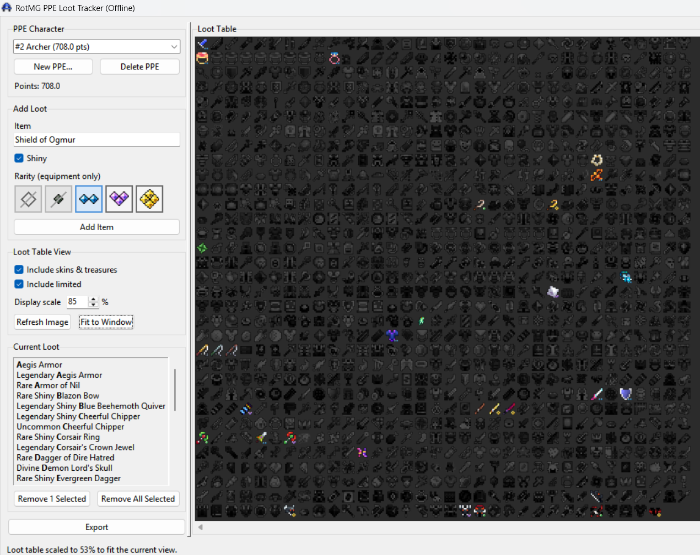

# RotMG PPE Loot Tracker (Offline)

Local desktop app for tracking PPE loot without Discord or network access. It uses the same loot catalog, point rules, and loot-table image logic as the Discord bot in the parent repository. **Windows only for now** (prebuilt executable and release zip)



## Requirements

The full **ROTMG PPE Discord Bot** repo (this app lives in `offline_app/` inside the bot repo):

**Python 3.10+** is only needed to run from source, run tests, or build a fresh executable. If you use `RotMG-PPE-Offline.exe` (which needs `_internal/`), you do not need Python installed.

## Download a release

Prebuilt releases are published on GitHub (under **Releases** on this fork). Download the latest zip and extract it where you keep the project (replacing an older copy, or into a new folder). Releases are **Windows only**.

Run `offline_app\RotMG-PPE-Offline.exe` from inside the extracted repository.

### Moving saves from an older install

Player data and settings live under `offline_app/`, not within the executable. To keep them when grabbing a new release:

1. From your **old** install, copy:
   - `offline_app/data/` (player JSON)
   - `offline_app/config.json` (if you changed settings)
2. Paste them into the **new** `offline_app/` folder, overwriting if prompted.
3. Start the new `RotMG-PPE-Offline.exe`.

(`offline_app/logs/` is optional to copy, skip unless you want old log files)

## Features

- Manage PPE characters by RotMG class
- Add/remove loot with item autocomplete
- Set equipment **rarity** and **shiny** when applicable
- Live **loot table image** with configurable display scale and fit-to-window
- **Export** the rendered loot table as PNG
- Autosave player data after loot changes
- Points computed with the same catalog and configurable rarity multipliers as the bot

## Workflow

1. **New PPE…** — pick a class. Use **Delete PPE** to remove the current character (with confirmation).
2. Search for an item in **Add Loot**.
3. For equipment, choose a **rarity** pip. Check **Shiny** when needed.
4. Click **Add Item** — the loot list and table update and save automatically.
5. Adjust **Display scale** (saved in config) or use **Fit to Window** for a one-off viewport fit.
6. Use **Export** to save the loot table image.

Toggle **Include skins & treasures** / **Include limited** to switch loot table variants.

## Configuration

`config.json` is created on first run beside the app:

| Key | Purpose |
|-----|---------|
| `player_name` | Display/default name for local saves |
| `player_data_file` | Path to player JSON |
| `include_skins` / `include_limited` | Default loot table variant toggles (`include_skins` also shows treasure items) |
| `loot_table_display_scale` | Default table zoom (0.05–1.0, e.g. `0.75` = 75%) |
| `points_settings.rarity_multipliers` | Point multipliers per rarity |
| `logging.level` | `DEBUG`, `INFO`, etc. |
| `logging.log_to_file` | Write logs to `logs/` |

## Data and logs

| Location | Contents |
|----------|----------|
| `data/` | Player loot JSON |
| `logs/` | Application log |
| `config.json` | Local settings |

If player JSON is corrupt on load, fix or delete the file and restart.

## Common issues

- **Blank loot table** — click **Refresh Image**; ensure `helper_pics/dungeon_pics/` exists in the parent repo (see [main README](../README.md)).
- **Item missing from search** — add it to `rotmg_loot_drops_updated.csv`.
- **Config error** — fix or delete `config.json` to reset defaults.

## Run from source

```powershell
cd offline_app
python -m venv .venv
.\.venv\Scripts\activate
pip install -r requirements.txt
python main.py
```

## Building the Windows executable (PyInstaller)

Builds `RotMG-PPE-Offline.exe` and `_internal/` in `offline_app/`. Loot CSV, sprites, and shared bot scripts still come from the parent repo at runtime.

If you already created `.venv` and installed dependencies while running from source, use `.\build.ps1 -SkipInstall`.

```powershell
cd offline_app
.\build.ps1
```

Run `offline_app\RotMG-PPE-Offline.exe`.

Clean build outputs: `.\build.ps1 -Clean` (removes PyInstaller staging under `.build/` and also deletes `RotMG-PPE-Offline.exe` and `_internal/` from `offline_app/`).

## Layout

```
offline_app/
  main.py
  app/
    core_adapter/   # loot catalog + renderer (uses parent repo files)
    storage/        # local JSON persistence
    config/
    ui/
  data/
  logs/
  tests/
```

## Tests

```powershell
cd offline_app
python -m unittest discover -s tests -v
```
